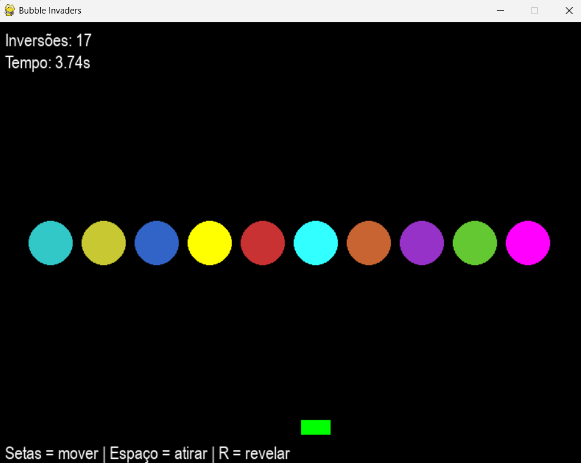
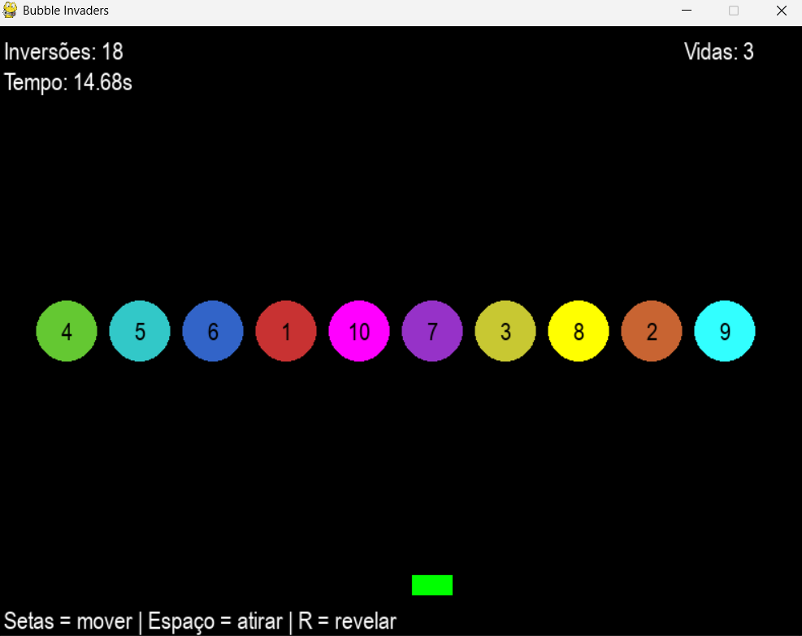
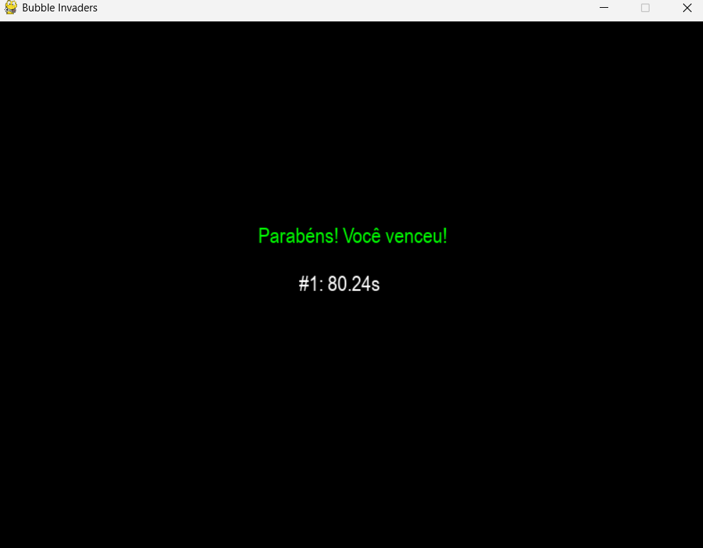

# D&C

**Número da Lista**: 4 <br>
**Conteúdo da Disciplina**: Dividir e Conquistar <br>

## Alunos
|Matrícula | Aluno |
| -- | -- |
| 211042327  |  Carlos Gabriel Cardoso Ramos |
| 202016604  |  João Lucas Miranda de Sousa |

## Sobre
### 🎯 Bubble Invaders

Bubble Invaders é um jogo arcade em Python usando `pygame`, onde seu objetivo é **organizar os inimigos numerados em ordem crescente**. Cada inimigo é representado por uma bolha colorida com um número escondido. Para vencer, é necessário realizar trocas estratégicas com o canhão e ordenar todas as bolhas!

---

## Screenshots




---

## 🕹️ Como Jogar

- ▶️ **Seta Direita/Esquerda:** mover o canhão horizontalmente.
- ⬆️ **Espaço:** disparar para trocar dois inimigos adjacentes.
- 🔁 **Tecla R:** revelar temporariamente os números das bolhas (máximo de 2 vezes por partida).
- 💥 **Objetivo:** ordenar todas as bolhas da esquerda para a direita usando o menor tempo possível.

⚠️ Se o número de inversões (desordem) for muito alto por tempo demais, o jogo acaba!

---

## 📦 Instalação

1. Clone este repositório ou baixe os arquivos:

```bash
git clone https://github.com/seu-usuario/bubble-invaders.git
cd bubble-invaders
```

2. Instale as dependências:

```bash
pip install pygame
```

3. Execute o jogo:

```bash
python3 main.py
```

---

## 🧠 Regras e Lógica

- O jogo começa com 10 bolhas em posições aleatórias.
- Cada tiro do canhão troca a posição da bolha atual com a vizinha da direita.
- O número de **inversões** (pares fora de ordem) é constantemente monitorado.
- Se houver **muita desordem por muito tempo**, você perde.
- O tempo de conclusão é registrado e os 5 melhores tempos aparecem na tela de vitória.
- O jogador vence quando todas as bolhas estiverem ordenadas em ordem crescente da esquerda para a direita (ou seja, 0 inversões restantes).

---

## 🛠️ Estrutura do Projeto

```
game/
├── main.py           # Arquivo principal (inicia o jogo)
├── core.py           # Lógica principal do jogo
├── constants.py      # Configurações e constantes
└── __init__.py       # Indica que é um pacote Python
```

---

## 🧑‍💻 Requisitos

- Python 3.10+
- pygame 2.1+

---

## 📜 Licença

Este projeto é livre para fins educacionais. Se for utilizar ou adaptar, considere dar créditos.

---
